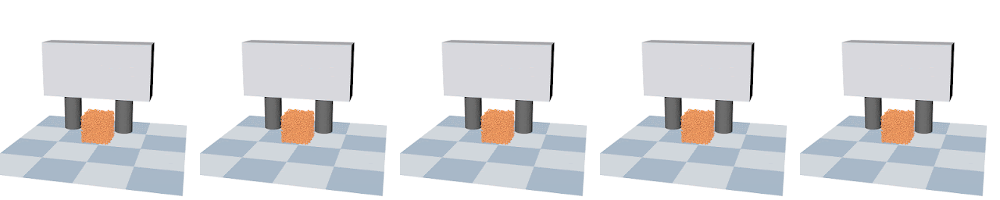
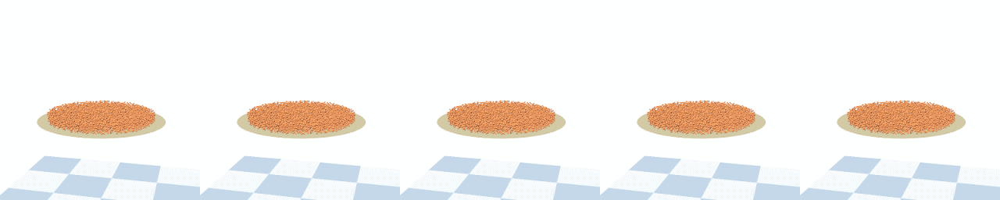

# SoftMAC
Implemetation for our paper "SoftMAC: Differentiable Soft Body Simulation with Forecast-based Contact Model and Two-way Coupling with Articulated Rigid Bodies and Clothes" (accepted to IROS 2024).

[[website]](https://damianliumin.github.io/SoftMAC/) [[arXiv]](https://arxiv.org/abs/2312.03297)

## Installation
Soft-rigid and soft-cloth coupling are implemented separately. The underlying cloth simulator DiffClothAI is not open-source yet, but we provide our code for soft-cloth coupling under `soft_cloth`. Soft-rigid coupling is already supported in this repository. Please follow the instructions:


#### Step 1: Create conda environment (recommended)
```bash
conda create -n softmac python=3.8
conda activate softmac
```
#### Step 2: Install Jade
Jade is the underlying articulated rigid body simulator. You can find it [here](https://github.com/NUS-LinS-Lab/Jade).

#### Step 3: Install SoftMAC

```bash
pip install -r requirements.txt
pip install -e .
```

## Demos
We optimize the action sequences with SoftMAC for each task.

**Demo 1: Pour wine**
```bash
python3 demo_pour.py
```


**Demo 2: Squeeze plasticine**
```bash
python3 demo_grip.py
```


**Demo 3: Pull door**
```bash
python3 demo_door.py
```


**Demo 4: Make taco**
```bash
# run under ./soft_cloth
python3 demo_taco.py
```


**Demo 5: Push towel**
```bash
# run under ./soft_cloth
python3 demo_hit.py
```


## Update
[2024.1] Add support for velocity control and an example `softmac/demo_pour_vel.py`. You can activate this mode by setting `rigid_velocity_control=True` in the configuration file.


## Note
Feel free to contact me at minliu2@cs.cmu.edu or create a Github issue if you have questions regarding setting up the repository, running examples or adding new examples.

## Citation
If you find our work useful, please consider citing:
```bash
@article{liu2023softmac,
  title={SoftMAC: Differentiable Soft Body Simulation with Forecast-based Contact Model and Two-way Coupling with Articulated Rigid Bodies and Clothes},
  author={Liu, Min and Yang, Gang and Luo, Siyuan and Yu, Chen and Shao, Lin},
  journal={arXiv preprint arXiv:2312.03297},
  year={2023}
}
```
