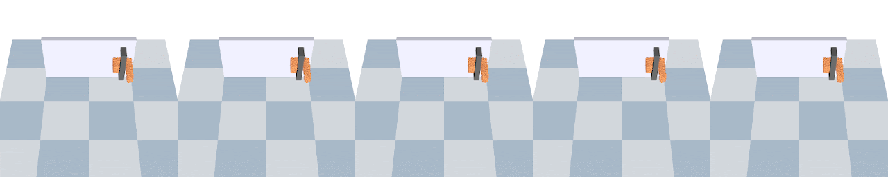

# SoftMAC
Implemetation for our paper "SoftMAC: Differentiable Soft Body Simulation with Forecast-based Contact Model and Two-way Coupling with Articulated Rigid Bodies and Clothes" (in submission).

[[project website]](https://sites.google.com/view/softmac)

## Installation
We provide soft-rigid and soft-cloth coupling separately. You can install them following the instructions in `soft_rigid/README.md` and `soft_cloth/README.md`.

(The underlying simulator for clothes is not open-source yet. We will update the links later.)

## Demos
We optimize the action sequences with SoftMAC for each task.

**Demo 1: Pour wine**
```bash
# run under ./soft_rigid
python3 demo_pour.py
```


**Demo 2: Squeeze plasticine**
```bash
# run under ./soft_rigid
python3 demo_grip.py
```


**Demo 3: Pull door**
```bash
# run under ./soft_rigid
python3 demo_door.py
```


**Demo 4: Make taco**
```bash
# run under ./soft_cloth
python3 demo_taco.py
```


**Demo 5: Push towel**
```bash
# run under ./soft_cloth
python3 demo_hit.py
```


## Note
Feel free to contact me at minliu2@cs.cmu.edu or create a Github issue if you have questions regarding setting up the repository, running examples or adding new examples.

## Citation
TBD
